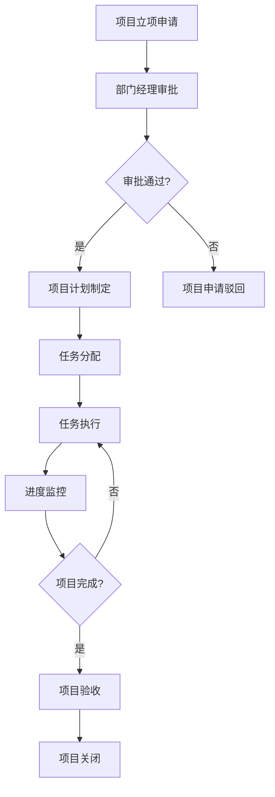
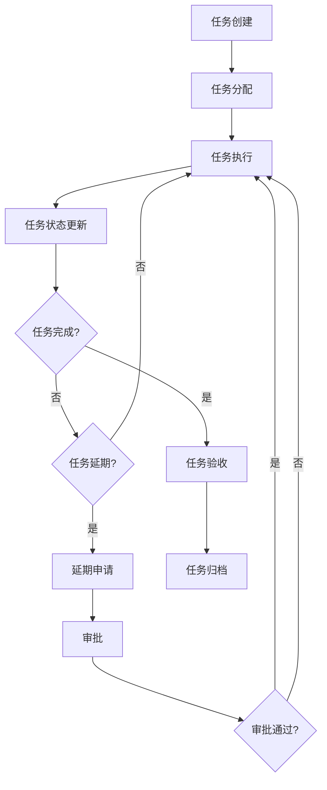
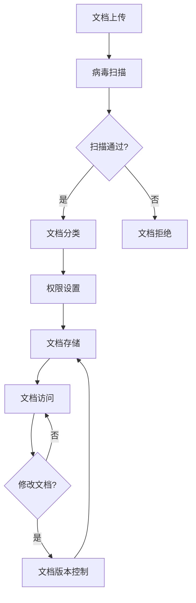

# 需求分析文档

## 目录

1. [项目概述](#项目概述)
2. [需求调研](#需求调研)
3. [功能需求](#功能需求)
4. [非功能需求](#非功能需求)
5. [业务流程分析](#业务流程分析)
6. [功能结构](#功能结构)
7. [数据需求](#数据需求)
8. [业务规则](#业务规则)
9. [验收标准](#验收标准)
10. [风险评估](#风险评估)
11. [项目实施计划](#项目实施计划)
12. [附录](#附录)

## 1. 项目概述

### 1.1 项目背景
随着企业业务的不断发展，项目数量和复杂度日益增加，传统的项目管理方式已经无法满足企业的需求。为了提高项目管理效率，规范项目管理流程，降低项目风险，企业需要一个现代化的项目管理系统来支撑项目的全生命周期管理。

### 1.2 项目目标
本项目旨在开发一个企业内部项目管理系统，实现项目的计划、执行、监控和收尾的全生命周期管理，提高项目管理效率，确保项目按时、按质、按预算完成。

### 1.3 核心业务领域
- 项目计划管理
- 任务分配与跟踪
- 资源管理
- 文档管理
- 沟通协作
- 报表分析

## 2. 需求调研

### 2.1 用户角色
| 角色 | 描述 |
|------|------|
| 系统管理员 | 负责系统配置、用户管理、权限设置等系统级操作 |
| 部门经理 | 负责部门项目的审批、资源分配、进度监控等 |
| 项目经理 | 负责项目的计划、执行、监控和收尾的全生命周期管理 |
| 团队成员 | 负责执行分配的任务，提交工作成果，反馈工作进展 |

### 2.2 场景分析

#### 2.2.1 项目创建场景
**用户**：项目经理
**场景**：项目经理需要创建一个新的项目，包括项目名称、描述、开始日期、结束日期、项目成员等信息。
**痛点**：传统方式需要填写大量表格，审批流程繁琐。

#### 2.2.2 任务分配场景
**用户**：项目经理
**场景**：项目经理需要将项目分解为多个任务，并分配给团队成员。
**痛点**：任务分配不透明，无法实时了解任务执行情况。

#### 2.2.3 进度跟踪场景
**用户**：项目经理、部门经理
**场景**：项目经理和部门经理需要实时了解项目进度，及时发现和解决问题。
**痛点**：传统方式需要定期召开会议，信息滞后，无法及时发现问题。

#### 2.2.4 文档管理场景
**用户**：所有角色
**场景**：项目成员需要上传、下载、共享项目文档。
**痛点**：文档分散在不同地方，版本控制困难，查找不便。

#### 2.2.5 沟通协作场景
**用户**：所有角色
**场景**：项目成员需要进行实时沟通，讨论项目问题。
**痛点**：沟通渠道分散，信息不集中，容易产生误解。

## 3. 功能需求

### 3.1 项目管理模块
- 项目创建与编辑
- 项目状态管理（立项、执行、暂停、关闭）
- 项目计划制定
- 项目里程碑设置
- 项目风险管理
- 项目文档管理

### 3.2 任务管理模块
- 任务创建与分配
- 任务状态跟踪（待办、进行中、已完成、延期）
- 任务依赖关系管理
- 任务优先级设置
- 任务工时统计

### 3.3 资源管理模块
- 人力资源管理（人员信息、技能、可用性）
- 物资资源管理
- 资源分配与调度
- 资源使用情况监控

### 3.4 文档管理模块
- 文档上传与下载
- 文档分类与标签
- 文档版本控制
- 文档权限管理
- 文档搜索与检索

### 3.5 沟通协作模块
- 项目讨论区
- 任务评论
- 通知与提醒
- 消息中心

### 3.6 报表分析模块
- 项目进度报表
- 资源使用报表
- 任务完成情况报表
- 项目成本分析
- 自定义报表

### 3.7 系统管理模块
- 用户管理
- 角色与权限管理
- 系统配置
- 日志管理
- 数据备份与恢复

## 4. 非功能需求

### 4.1 性能需求
- 系统响应时间：页面加载时间不超过2秒
- 并发用户数：支持1000人同时在线
- 数据处理能力：每秒处理100个请求
- 报表生成时间：复杂报表生成时间不超过10秒

### 4.2 安全需求
- 身份认证：基于用户名和密码的认证机制，支持LDAP集成
- 权限控制：基于角色的权限管理（RBAC）
- 数据加密：敏感数据传输和存储加密
- 安全审计：记录系统操作日志
- 防SQL注入、XSS等攻击

### 4.3 兼容性需求
- 浏览器支持：兼容Chrome、Firefox、Safari、Edge等主流浏览器
- 操作系统支持：兼容Windows、macOS、Linux等操作系统
- 移动设备支持：支持iOS、Android等移动设备的访问

### 4.4 可扩展性需求
- 系统架构：采用模块化、松耦合的架构
- 数据存储：支持数据量的线性增长
- 功能扩展：支持插件式功能扩展
- 集成能力：支持与企业其他系统（如ERP、CRM）的集成

### 4.5 易用性需求
- 界面设计：简洁、直观、符合用户习惯
- 操作流程：简化操作步骤，减少用户认知负担
- 帮助系统：提供详细的用户指南和帮助文档
- 错误处理：友好的错误提示和恢复机制

## 5. 业务流程分析

### 5.1 项目生命周期流程

### 5.2 任务管理流程

### 5.3 文档管理流程

## 6. 功能结构

### 6.1 系统功能架构

```mermaid
flowchart TD
    A[项目管理系统] --> B[项目管理模块]
    A --> C[任务管理模块]
    A --> D[资源管理模块]
    A --> E[文档管理模块]
    A --> F[沟通协作模块]
    A --> G[报表分析模块]
    A --> H[系统管理模块]
    
    B --> B1[项目创建与编辑]
    B --> B2[项目状态管理]
    B --> B3[项目计划制定]
    B --> B4[项目里程碑设置]
    B --> B5[项目风险管理]
    B --> B6[项目文档管理]
    
    C --> C1[任务创建与分配]
    C --> C2[任务状态跟踪]
    C --> C3[任务依赖关系管理]
    C --> C4[任务优先级设置]
    C --> C5[任务工时统计]
    
    D --> D1[人力资源管理]
    D --> D2[物资资源管理]
    D --> D3[资源分配与调度]
    D --> D4[资源使用情况监控]
    
    E --> E1[文档上传与下载]
    E --> E2[文档分类与标签]
    E --> E3[文档版本控制]
    E --> E4[文档权限管理]
    E --> E5[文档搜索与检索]
    
    F --> F1[项目讨论区]
    F --> F2[任务评论]
    F --> F3[通知与提醒]
    F --> F4[消息中心]
    
    G --> G1[项目进度报表]
    G --> G2[资源使用报表]
    G --> G3[任务完成情况报表]
    G --> G4[项目成本分析]
    G --> G5[自定义报表]
    
    H --> H1[用户管理]
    H --> H2[角色与权限管理]
    H --> H3[系统配置]
    H --> H4[日志管理]
    H --> H5[数据备份与恢复]
```

### 6.2 用户角色权限矩阵

| 功能模块 | 系统管理员 | 部门经理 | 项目经理 | 团队成员 |
|---------|-----------|---------|---------|---------|
| 项目管理 | 全部 | 审批、监控 | 全部 | 查看 |
| 任务管理 | 全部 | 监控 | 全部 | 执行、反馈 |
| 资源管理 | 全部 | 分配、监控 | 申请、使用 | 查看 |
| 文档管理 | 全部 | 查看、审批 | 管理 | 查看、上传 |
| 沟通协作 | 全部 | 全部 | 全部 | 全部 |
| 报表分析 | 全部 | 查看 | 查看、生成 | 查看 |
| 系统管理 | 全部 | 部分 | 无 | 无 |

## 7. 数据需求

### 7.1 数据实体
- 项目（Project）
- 任务（Task）
- 用户（User）
- 资源（Resource）
- 文档（Document）
- 评论（Comment）
- 通知（Notification）
- 报表（Report）

### 7.2 数据关系
- 一个项目包含多个任务
- 一个用户可以参与多个项目
- 一个任务可以分配给多个用户
- 一个项目可以包含多个文档
- 一个任务可以有多个评论

### 7.3 数据存储
- 关系型数据库：存储结构化数据
- 文件系统：存储文档、图片等非结构化数据
- 缓存：提高系统性能

## 8. 业务规则

### 8.1 项目管理规则
- 项目必须经过部门经理审批才能立项
- 项目状态变更必须由项目经理或系统管理员操作
- 项目关闭前必须完成所有任务

### 8.2 任务管理规则
- 任务必须分配给至少一个团队成员
- 任务状态变更必须由任务负责人或项目经理操作
- 任务延期必须提交延期申请并获得批准

### 8.3 资源管理规则
- 资源分配必须考虑资源的可用性
- 资源使用必须记录使用情况
- 资源超出预算必须及时通知相关人员

### 8.4 文档管理规则
- 文档上传必须经过病毒扫描
- 文档权限必须明确设置
- 文档版本必须保留历史记录

## 9. 验收标准

### 9.1 功能验收
- 所有功能模块按照需求规格说明书实现
- 功能操作流程正确，无错误
- 数据处理准确，无数据丢失或错误

### 9.2 性能验收
- 系统响应时间符合性能需求
- 并发用户数满足要求
- 报表生成时间符合要求

### 9.3 安全验收
- 身份认证和权限控制有效
- 数据加密和安全审计功能正常
- 无安全漏洞

### 9.4 兼容性验收
- 在主流浏览器中正常运行
- 在不同操作系统中正常运行
- 在移动设备上正常访问

### 9.5 易用性验收
- 界面设计符合用户习惯
- 操作流程简单明了
- 帮助系统完整有效

## 10. 风险评估

### 10.1 技术风险
- 系统集成风险：与企业现有系统的集成可能遇到兼容性问题
- 性能风险：系统在高并发情况下可能出现性能问题
- 安全风险：系统可能存在安全漏洞

### 10.2 业务风险
- 需求变更风险：项目过程中可能出现需求变更
- 资源风险：项目实施过程中可能遇到资源不足的问题
- 时间风险：项目可能无法按时完成

### 10.3 风险缓解措施
- 技术风险：进行充分的技术调研和测试，确保系统的稳定性和安全性
- 业务风险：建立需求变更管理流程，合理规划资源，制定详细的项目计划

## 11. 项目实施计划

### 11.1 开发阶段
- 需求分析与设计：2周
- 系统开发：8周
- 系统测试：4周
- 系统部署：2周

### 11.2 里程碑
- 需求分析完成：第2周末
- 系统设计完成：第4周末
- 系统开发完成：第12周末
- 系统测试完成：第16周末
- 系统上线：第18周末

## 12. 附录

### 12.1 术语定义
- 项目：为实现特定目标而进行的一次性工作
- 任务：项目的具体工作单元
- 资源：项目执行所需的人力、物力、财力等
- 里程碑：项目中的重要时间点
- RBAC：基于角色的访问控制

### 12.2 参考资料
- 《项目管理知识体系指南》（PMBOK Guide）
- 《软件工程》（第9版）
- 企业现有项目管理流程文档